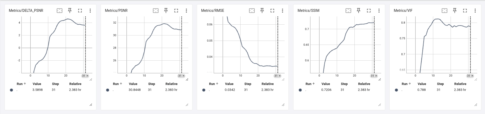
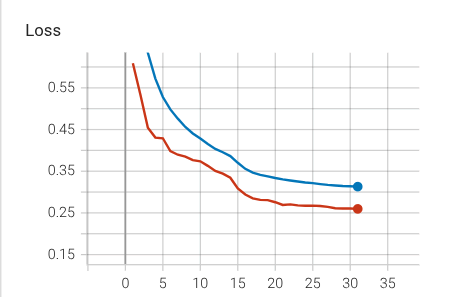
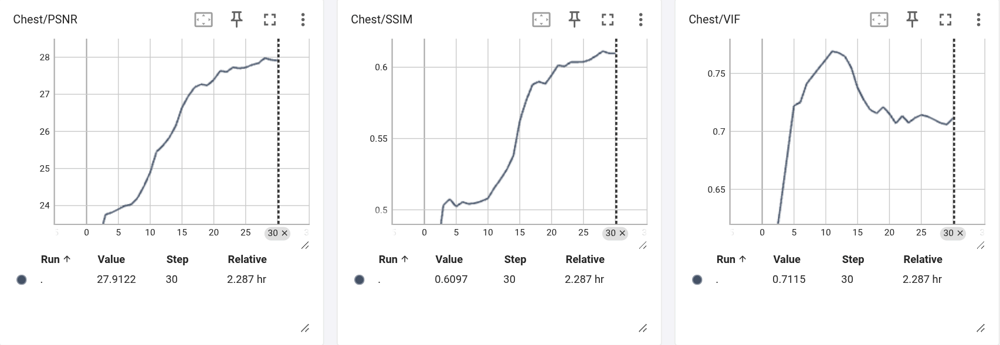
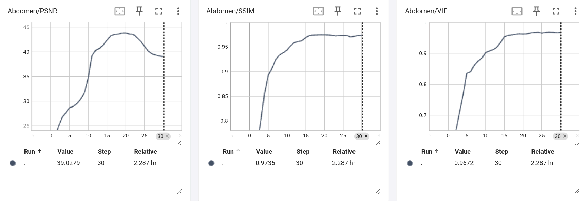

# LDCT Denoising — 2.5D Pseudo-3D U-Net Pipeline

A comprehensive, modular deep learning pipeline built with **PyTorch** and **MONAI** for **Low-Dose CT (LDCT) denoising**. This project aims to enhance the quality of LDCT images to match Normal-Dose CT (NDCT) scans by utilizing a pseudo-3D (2.5D) context, capturing spatial relationships across adjacent anatomical slices.

## ✨ Key Features

* **Pseudo-3D (2.5D) Architecture**: Instead of processing independent 2D slices, the pipeline stacks three consecutive slices (`prev`, `curr`, `next`) into a single 3-channel input. The model predicts the noise residual for the central slice, preserving crucial 3D anatomical context.
* **Custom NBIA Downloader**: An automated, multi-threaded dataset downloader fetching data directly from The Cancer Imaging Archive (TCIA). It features resume-support, progress tracking, and carefully selects exactly 100 hardcoded patients (stratified into Chest and Abdomen).
* **Advanced Hybrid Loss Function**: A meticulously tuned combination of **L1 Loss** (pixel accuracy), **SSIM Loss** (structural similarity), **VGG Perceptual Loss** (high-level feature preservation), and **Sobel Edge Loss** (boundary sharpness).
* **Full-Resolution Evaluation**: The evaluation script tests the model on the *full original DICOM resolution* without cropping or padding, outputting visual fidelity metrics like **VIF (Visual Information Fidelity)** alongside PSNR, SSIM, and RMSE.
* **Automatic Mixed Precision (AMP)**: Optimized training loop using PyTorch's `autocast` and `GradScaler` for faster compute and reduced memory footprint.

---

## 🗂️ Project Structure

```text
LDCT-Project/
├── config.py          # Centralized hyperparameter, paths, and constants registry
├── dataset.py         # Pseudo-3D data pipeline (MONAI transforms, dataloaders)
├── download.py        # Parallel NBIA dataset downloader with size estimation & resume
├── evaluate.py        # Full-resolution testing, metric calculation (VIF, RMSE), and visualizations
├── losses.py          # MONAI Hybrid Loss (L1 + SSIM + VGG19 Perceptual + Sobel Edge)
├── metrics.py         # Evaluation metrics including TorchMetrics VisualInformationFidelity
├── model.py           # MONAI U-Net builder with automatic DataParallel support
├── train.py           # Main training loop with Checkpointing, Early Stopping, and TensorBoard
├── utils.py           # Reproducibility constraints and DICOM metadata sorting
└── requirements.txt   # Python dependencies

```

---

## 🔬 Methodology & Pipeline

### 1. Data Processing

* **Hounsfield Unit (HU) Windowing**: DICOM pixel arrays are clipped to a specific clinical window (`-1024` to `1600`) and normalized to `[0, 1]`.
* **Augmentation**: During training, data undergoes `RandSpatialCropSamplesd` (256x256). Validation applies deterministic `ResizeWithPadOrCropd`.

### 2. Network Architecture

A MONAI `UNet` initialized with:

* **Input**: 3 channels (Pseudo-3D).
* **Output**: 1 channel (Predicted noise residual).
* **Layers**: Configured with feature channels `(32, 64, 128, 256)`, strides `(2, 2, 2)`, and 2 residual units per layer.

### 3. Loss Weights

| Component | Weight (`λ`) | Objective |
| --- | --- | --- |
| **L1 Loss** | `1.0` | Exact pixel-wise reconstruction. |
| **SSIM Loss** | `0.5` | Structural integrity and luminance preservation. |
| **VGG Perceptual** | `0.1` | High-level texture similarity using frozen VGG-19 features. |
| **Sobel Edge** | `0.05` | Penalization for blurred anatomical boundaries. |

---

## 🚀 Getting Started

### Prerequisites

Ensure you have Python ≥ 3.9 installed. For optimal performance, a CUDA-enabled GPU is highly recommended. *(Note for Fedora/Linux users: ensure your NVIDIA drivers and CUDA toolkit match your PyTorch wheel).*

```bash
# Clone the repository and install dependencies
git clone https://github.com/BrahimSoufghalem/pseudo3d-ldct-denoising.git
cd pseudo3d-ldct-denoising
pip install -r requirements.txt

```

### 1. Download & Prepare the Dataset

The custom downloader fetches exactly 100 specific patients from the [LDCT-and-projection-data](https://www.cancerimagingarchive.net/collection/ldct-and-projection-data/) collection, sorted by dataset size and stratified by anatomy:

* **Training Set**: 84 patients (42 Chest, 42 Abdomen).
* **Testing Set**: 16 patients (8 Chest, 8 Abdomen).

```bash
python download.py

```

*This generates a `download_report.csv` and safely skips already-downloaded files if interrupted.*

### 2. Training the Model

Training utilizes `ReduceLROnPlateau` scheduling, Gradient Clipping, and logs everything to TensorBoard.

```bash
python train.py

```

To monitor training curves, losses, and image outputs in real-time:

```bash
tensorboard --logdir FinalCT_2.5D-UNET-DATASET/logs

```

### 3. Clinical Evaluation

Evaluate the model's performance on the unseen `test/` directory. The evaluation runs on the **unaltered, original spatial resolution** of the DICOM files to reflect true clinical applicability.

```bash
# Run evaluation and generate a CSV report
python evaluate.py

# Run evaluation AND save comparative visualization images (LDCT vs NDCT vs Denoised)
python evaluate.py --save-images

```

---

## ⚙️ Configuration

The entire behavior of the pipeline is controlled via [`config.py`](https://www.google.com/search?q=config.py). You do not need to hunt for hardcoded values.

**Key Hyperparameters:**

* `TOTAL_EPOCHS`: 50
* `LEARNING_RATE`: 1e-4 (AdamW)
* `TRAIN_BATCH_SIZE`: 32
* `SPATIAL_SIZE`: (256, 256)
* `CACHE_DATA`: True (Accelerates training by storing processed files in RAM)

---

## 📊 Evaluation Metrics

The script `evaluate.py` outputs per-patient, per-body-type, and overall averages for:

* **PSNR** (Peak Signal-to-Noise Ratio) - Higher is better.
* **ΔPSNR** - Net improvement over the baseline LDCT image.
* **SSIM** (Structural Similarity Index) - Higher is better.
* **RMSE** (Root Mean Squared Error) - Lower is better.
* **VIF** (Visual Information Fidelity) - Highly sensitive metric for fine medical details like nodules and sharp edges.
## 📉 Training Curves & Performance

The model demonstrates stable convergence and significant improvements in image quality metrics across both Chest and Abdomen datasets. The training and validation loss curves show healthy learning dynamics without severe overfitting.

### Overall Metrics
Here is the evaluation metrics (PSNR, SSIM, VIF, RMSE, and Delta PSNR) over the training epochs:

<p align="left">
  
</p>

### Loss
Here is the convergence of the training/validation loss :
<p align="left">
  
</p>

### Performance by Anatomy (Chest (10% dose) vs. Abdomen (25% dose))
The model was evaluated separately on Chest and Abdomen slices to ensure robust feature extraction across different anatomical structures and noise profiles.

**Chest Metrics:**
<p align="left">
  
</p>

**Abdomen Metrics:**
<p align="left">
  
</p>

## 👁️ Qualitative Results (Visual Comparisons)

The following side-by-side comparisons demonstrate the model's ability to effectively suppress noise and artifacts in Low-Dose CT (LDCT) scans while faithfully preserving fine anatomical details, edges, and soft tissue structures compared to the Full-Dose (NDCT) ground truth.

**Display Order:** `[ Left: Full Dose (NDCT) | Middle: AI Denoised | Right: Low Dose (LDCT) ]`

### Chest CT Scan
<p align="left">
  
</p>

### Abdomen CT Scans
<p align="left">
  
</p>
<p align="left">
  
</p>
