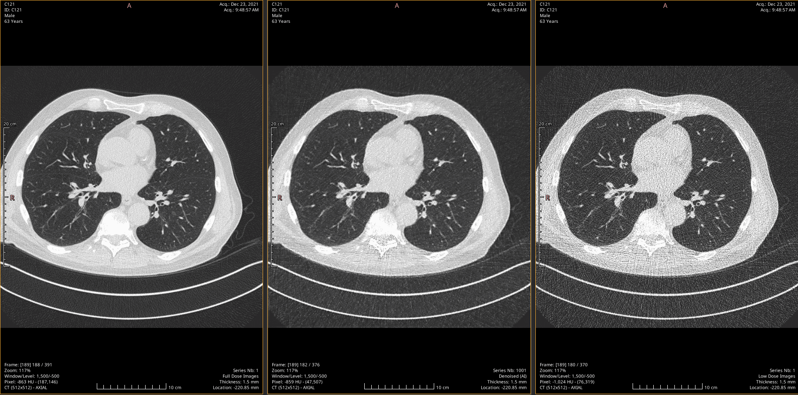
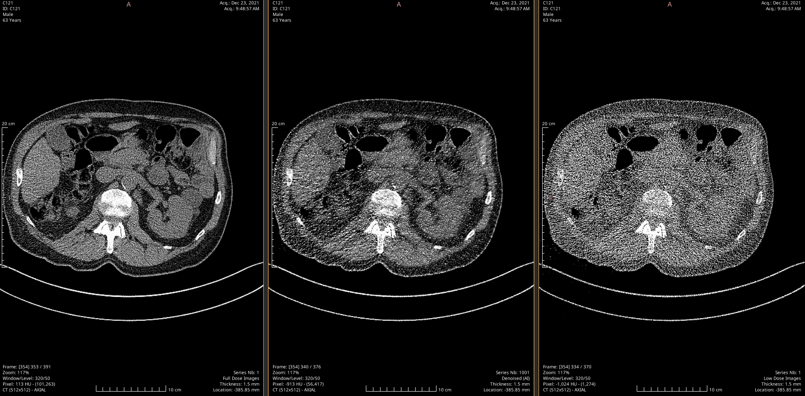
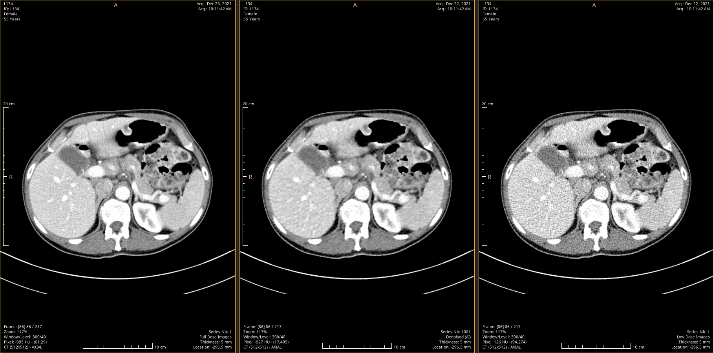

# LDCT Denoising — 2.5D Pseudo-3D Residual U-Net Pipeline

A comprehensive, modular deep learning pipeline built with **PyTorch** and **MONAI** for **Low-Dose CT (LDCT) denoising**. This project enhances degraded LDCT images toward Full-Dose CT (NDCT) quality by leveraging a pseudo-3D (2.5D) context that captures spatial continuity across adjacent anatomical slices.
 
---

## ✨ Key Features

- **Pseudo-3D (2.5D) Architecture** — Instead of processing independent 2D slices, the pipeline stacks three consecutive slices (`prev`, `curr`, `next`) into a single 3-channel input. The model predicts the **noise residual** of the central slice, preserving crucial inter-slice anatomical context.
- **Custom NBIA Downloader** — Automated, multi-threaded dataset downloader fetching data directly from The Cancer Imaging Archive (TCIA). Features resume-support, progress tracking, and selects exactly 100 hardcoded patients stratified by anatomy (Chest / Abdomen).
- **Advanced Hybrid Loss Function** — A meticulously tuned combination of **L1 Loss** (pixel accuracy), **SSIM Loss** (structural similarity), **VGG-19 Perceptual Loss** (high-level feature preservation), and **Sobel Edge Loss** (boundary sharpness).
- **Full-Resolution Evaluation** — The evaluation script tests the model on the *full, unaltered original DICOM resolution* without cropping or padding, yielding clinically meaningful metrics.
- **Automatic Mixed Precision (AMP)** — Optimized training loop using PyTorch `autocast` and `GradScaler` for faster compute and reduced memory footprint.
- **Pre-trained Weights Included** — The repository ships with `best_model.pt` so you can run evaluation and inference immediately — no training required.
- **PACS-Ready DICOM Export** — `inference_dicom.py` reverses HU normalization and copies all original patient metadata, producing output files that can be directly ingested by clinical PACS systems.

---

## 🗂️ Project Structure

```text
pseudo3d-ldct-denoising/
├── FinalCT_2.5D-UNET-DATASET/
│   └── best_model.pt      # ✅ Pre-trained model weights (included out-of-the-box!)
├── images/                # README images and qualitative visual results
├── .gitignore             # Ignored files and cache directories
├── LICENSE                # MIT License for open-source distribution
├── README.md              # Project documentation
├── config.py              # Centralized hyperparameter, paths, and constants registry
├── dataset.py             # Pseudo-3D data pipeline (MONAI transforms, dataloaders)
├── download.py            # Parallel NBIA dataset downloader with size estimation & resume
├── evaluate.py            # Full-resolution testing, metric calculation (VIF, RMSE), and visualizations
├── inference_dicom.py     # End-to-end inference & PACS-ready DICOM export script
├── losses.py              # MONAI Hybrid Loss (L1 + SSIM + VGG19 Perceptual + Sobel Edge)
├── metrics.py             # Evaluation metrics including TorchMetrics VisualInformationFidelity
├── model.py               # MONAI U-Net builder with automatic DataParallel support
├── requirements.txt       # Python dependencies
├── train.py               # Main training loop with Checkpointing, Early Stopping, and TensorBoard
└── utils.py               # Reproducibility constraints and DICOM metadata sorting
```

---

## 🔬 Methodology & Pipeline

### 1. Data Processing

- **Hounsfield Unit (HU) Windowing** — DICOM pixel arrays are clipped to a clinical window (`-1024` to `1600`) and normalized to `[0, 1]`.
- **Augmentation** — During training, data undergoes `RandSpatialCropSamplesd` (256×256). Validation applies deterministic `ResizeWithPadOrCropd`.

### 2. Network Architecture

A MONAI `UNet` initialized with:

| Parameter | Value |
|---|---|
| **Input channels** | 3 (Pseudo-3D: prev / curr / next slice) |
| **Output channels** | 1 (Predicted noise residual) |
| **Feature maps** | `(32, 64, 128, 256)` |
| **Strides** | `(2, 2, 2)` |
| **Residual units** | 2 per layer |

### 3. Hybrid Loss Weights

| Component | Weight (λ) | Objective |
|---|---|---|
| **L1 Loss** | `1.0` | Exact pixel-wise reconstruction |
| **SSIM Loss** | `0.5` | Structural integrity and luminance preservation |
| **VGG-19 Perceptual** | `0.1` | High-level texture similarity (frozen features) |
| **Sobel Edge** | `0.05` | Penalization for blurred anatomical boundaries |

---

## 🚀 Getting Started

### Prerequisites

Python ≥ 3.9. A CUDA-enabled GPU is strongly recommended.

```bash
git clone https://github.com/BrahimSoufghalem/pseudo3d-ldct-denoising.git
cd pseudo3d-ldct-denoising
pip install -r requirements.txt
```

> 🔥 **Quick Start with Pre-trained Weights**
> This repository includes the pre-trained weights (`FinalCT_2.5D-UNET-DATASET/best_model.pt`).
> You can **skip Steps 1 and 2 entirely** — just download the test set and jump straight to
> **[Step 3 (Evaluation)](#3-evaluation)** or **[Step 4 (Inference & DICOM Export)](#4-inference--dicom-export)**.

### 1. Download & Prepare the Dataset

The custom downloader fetches exactly 100 specific patients from the [LDCT-and-projection-data](https://www.cancerimagingarchive.net/collection/ldct-and-projection-data/) collection, stratified by anatomy:

| Split | Chest (C*) | Abdomen (L*) | Total |
|---|---|---|---|
| **Training** | 42 patients | 42 patients | 84 |
| **Testing** | 8 patients | 8 patients | 16 |

> Patient IDs beginning with **`C`** are Chest scans acquired at **10% dose**. IDs beginning with **`L`** are Abdomen scans at **25% dose**. This naming convention mirrors the original TCIA collection structure.

```bash
python download.py
# Generates download_report.csv; safely resumes if interrupted
```

### 2. Training

```bash
python train.py
tensorboard --logdir FinalCT_2.5D-UNET-DATASET/logs
```

Training uses `ReduceLROnPlateau` scheduling, gradient clipping, and logs losses and sample images to TensorBoard in real time.

### 3. Evaluation

```bash
python evaluate.py              # Generate CSV metrics report
python evaluate.py --save-images  # Also save LDCT | Denoised | NDCT comparisons
```

### 4. Inference & DICOM Export

Apply the trained model to any LDCT scan directory and save the enhanced results as new, **PACS-ready DICOM files**. The script reverses the internal HU normalization to restore true Hounsfield Unit values and preserves all patient-level metadata (PatientID, StudyInstanceUID, demographics, acquisition parameters). 

Each enhanced scan is exported as a new DICOM series with a newly generated SeriesInstanceUID and SOPInstanceUIDs per slice, ensuring full compatibility with PACS and clinical viewers while avoiding conflicts with the original data.

```bash
python inference_dicom.py --test-dir test --output-dir Enhanced_CT_Results
```


The output directory mirrors the input structure, with each enhanced slice saved as an individual DICOM file forming an independent AI-generated series labeled "Denoised (AI)".

---

## ⚙️ Key Hyperparameters

| Parameter | Value |
|---|---|
| `TOTAL_EPOCHS` | 50 |
| `LEARNING_RATE` | 1e-4 (AdamW) |
| `TRAIN_BATCH_SIZE` | 32 |
| `SPATIAL_SIZE` | (256, 256) |
| `CACHE_DATA` | True |

---

## 📊 Evaluation Results

### Per-Patient Breakdown (16 Test Patients)

| Patient | Body Type | Dose | Slices | PSNR (dB) | ΔPSNR (dB) | SSIM | RMSE | VIF |
|---|---|---|---|---|---|---|---|---|
| **L006** | Abdomen | 25% | 215 | 45.96 | +1.20 | 0.9844 | 0.00509 | 0.9847 |
| **L049** | Abdomen | 25% | 220 | 45.11 | +1.69 | 0.9803 | 0.00571 | 0.9870 |
| **L058** | Abdomen | 25% | 210 | 44.31 | +1.81 | 0.9760 | 0.00633 | 0.9852 |
| **L116** | Abdomen | 25% | 228 | 44.85 | +0.75 | 0.9818 | 0.00580 | 0.9761 |
| **L134** | Abdomen | 25% | 217 | **46.18** | +1.50 | **0.9839** | **0.00494** | **0.9876** |
| **L150** | Abdomen | 25% | 221 | 43.29 | +1.92 | 0.9756 | 0.00708 | 0.9680 |
| **L203** | Abdomen | 25% | 223 | 44.72 | +1.59 | 0.9795 | 0.00592 | 0.9797 |
| **L277** | Abdomen | 25% | 214 | 44.07 | **+2.26** | 0.9743 | 0.00639 | 0.9840 |
| **C050** | Chest | 10% | 394 | 29.77 | +4.81 | 0.6560 | 0.03316 | 0.8351 |
| **C077** | Chest | 10% | 386 | 28.03 | +4.83 | 0.5928 | 0.04153 | 0.7891 |
| **C107** | Chest | 10% | 391 | **32.06** | +4.58 | **0.7338** | **0.02504** | **0.9013** |
| **C121** | Chest | 10% | 392 | 26.82 | +4.74 | 0.5475 | 0.04641 | 0.8086 |
| **C124** | Chest | 10% | 383 | 25.62 | +4.67 | 0.5103 | 0.05346 | 0.7841 |
| **C130** | Chest | 10% | 379 | 25.77 | +4.72 | 0.5239 | 0.05349 | 0.7316 |
| **C166** | Chest | 10% | 396 | 28.72 | +4.72 | 0.6377 | 0.03777 | 0.8247 |
| **C234** | Chest | 10% | 380 | 28.67 | +4.88 | 0.6298 | 0.03857 | 0.8243 |

> Bold values indicate the best result within each anatomy group. ΔPSNR = model PSNR − baseline (raw LDCT) PSNR.

### Summary by Anatomy

| Metric | Abdomen (L*, 25% dose) | Chest (C*, 10% dose) |
|---|---|---|
| **Avg PSNR** | 44.81 dB | 28.18 dB |
| **Avg Baseline PSNR** | 43.22 dB | 23.44 dB |
| **Avg ΔPSNR** | **+1.59 dB** | **+4.74 dB** |
| **Avg SSIM** | 0.9795 | 0.6040 |
| **Avg RMSE** | 0.00591 | 0.04118 |
| **Avg VIF** | 0.9815 | 0.8124 |

---

## 🔍 Analysis: Why Chest and Abdomen Metrics Differ

The substantial gap between Chest and Abdomen results is **not a modeling failure** — it is a well-grounded, scientifically expected consequence of two confounding variables that are intrinsic to the TCIA dataset itself: **dose level** and **anatomical complexity**.

### 1. Dose Level Is the Primary Driver

The LDCT-and-Projection-Data collection encodes dose levels in patient IDs:

| Prefix | Anatomy | Acquisition Dose | Noise Level |
|---|---|---|---|
| `C*` | Chest | **10% of full dose** | Extreme |
| `L*` | Abdomen | **25% of full dose** | Moderate |

At 10% dose, quantum noise variance is approximately **2.5× higher** than at 25% dose. The raw baseline PSNR difference confirms this: Abdomen starts at **43.22 dB** before any enhancement, while Chest starts at only **23.44 dB** — a gap of ~19.8 dB. The model is therefore solving a fundamentally harder inverse problem for Chest scans.

### 2. The Model Is More Effective on Chest — Relatively Speaking

A critical observation is that **ΔPSNR reverses the story**:

| Anatomy | Avg ΔPSNR | Interpretation |
|---|---|---|
| Abdomen (25% dose) | +1.59 dB | Moderate noise → modest room for improvement |
| Chest (10% dose) | **+4.74 dB** | Extreme noise → model provides 3× more improvement |

The model delivers nearly **3× the absolute gain** on Chest scans compared to Abdomen. This demonstrates that the architecture is successfully exploiting the larger noise signal rather than being overwhelmed by it.

### 3. Anatomical Complexity Compounds the Challenge

Even at the same dose level, Chest CT is inherently harder to denoise than Abdomen CT due to its structural heterogeneity:

| Factor | Chest | Abdomen |
|---|---|---|
| **Dominant tissue** | Air (lungs, ~−800 HU), bone (ribs), soft tissue | Uniform soft tissue (liver, kidney, spleen) |
| **Fine structures** | Bronchial trees, pulmonary vessels, nodules | Large, smooth organ boundaries |
| **Signal-to-noise regime** | Very low HU regions → noise is relatively large | High HU soft tissue → noise is relatively small |
| **Boundary types** | Sharp air-tissue interfaces (hard to preserve) | Gradual organ edges (easier to smooth) |

At 10% dose, quantum noise is superimposed on already-low Hounsfield Unit values in the lung parenchyma. Relative to the underlying signal, this noise is disproportionately large, making fine structures like bronchioles and small vessels extremely difficult to recover. By contrast, abdominal soft tissue has a high and uniform HU baseline, making noise comparatively easier to distinguish and suppress.

### 4. Intra-Group Variability and the C107 Outlier

Within the Chest group, **C107 stands out**: PSNR = 32.06 dB, SSIM = 0.734, VIF = 0.901 — markedly better than the group mean. This likely reflects a specific scan acquired at a higher mA setting, a patient with less respiratory motion, or a body habitus that reduces beam attenuation. It illustrates that dose-level labels are nominal and that actual scan quality varies within a group.

Within Abdomen, **L277 achieves the highest ΔPSNR (+2.26 dB)** despite a moderate final PSNR, suggesting it started from a particularly noisy baseline (lowest Abdomen baseline at 41.80 dB) and benefited most from denoising.

### 5. Summary Interpretation

| Observation | Explanation |
|---|---|
| Abdomen PSNR >> Chest PSNR | 25% dose → lower noise → higher absolute fidelity |
| Chest ΔPSNR >> Abdomen ΔPSNR | 10% dose → more noise → larger margin for improvement |
| Abdomen SSIM ≈ 0.98, Chest SSIM ≈ 0.60 | Structural complexity of lung anatomy + dose effect |
| Abdomen VIF ≈ 0.98, Chest VIF ≈ 0.81 | VIF is sensitive to fine detail loss, which is severe under 10% dose |

> **Conclusion:** The two anatomy groups should not be compared on absolute metrics alone. Chest results at 10% dose represent a significantly harder denoising task, and the model's +4.74 dB average gain on Chest images demonstrates meaningful clinical effectiveness even under extreme noise conditions.

---

## 📉 Training Curves & Performance

The model demonstrates stable convergence with healthy learning dynamics and no severe overfitting across both anatomy types.

### Overall Metrics Over Epochs
<p align="left">
  
</p>

### Loss Curve
<p align="left">
  
</p>

### Chest Metrics (10% dose)
<p align="left">
  
</p>

### Abdomen Metrics (25% dose)
<p align="left">
  
</p>

---

## 👁️ Qualitative Results

Side-by-side comparisons demonstrate the model's ability to suppress noise while preserving fine anatomical edges, soft tissue structures, and diagnostic detail.

**Display Order:** `[ Left: Full Dose (NDCT) | Middle: AI Denoised | Right: Low Dose (LDCT) ]`

### Chest CT — 10% Dose
<p align="left">
  
</p>

### Abdomen CT — 10% Dose
<p align="left">
  
</p>
Note: This abdominal slice is extracted from a Chest (C) patient scan acquired at a 10% dose. It demonstrates the model's robust denoising performance on abdominal soft tissues even under extreme quantum noise conditions.*

### Abdomen CT — 25% Dose
<p align="left">
  
</p>

---

## 📦 Evaluation Metrics Reference

| Metric | Direction | Description |
|---|---|---|
| **PSNR** | ↑ Higher is better | Peak Signal-to-Noise Ratio — overall fidelity |
| **ΔPSNR** | ↑ Higher is better | Net gain over the raw LDCT baseline |
| **SSIM** | ↑ Higher is better | Structural Similarity — luminance, contrast, structure |
| **RMSE** | ↓ Lower is better | Root Mean Squared Error — pixel-level deviation |
| **VIF** | ↑ Higher is better | Visual Information Fidelity — sensitive to fine clinical details |

---

## 📄 License

This project is released for research and educational purposes. See `LICENSE` for details.
